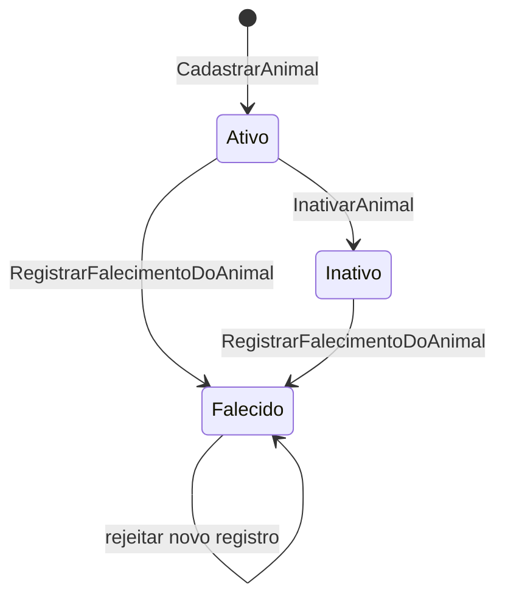

# ADR-0005: Ciclo de vida operacional do Animal

- **Status:** Aceita
- **Data:** 2026-07-21
- **Decisao:** usar situacao explicita minima com `Ativo`, `Inativo` e `Falecido`

## Contexto

O aggregate `Animal` nasceu com dados cadastrais simples e situacao `Ativo/Inativo`. O SDD 22 consolidou a responsabilidade operacional vigente por tutor, mas ainda restava ambiguidade no ciclo de vida do animal.

Para as proximas entregas, especialmente Agenda e Atendimento, falecimento precisa ser distinguido de inativacao cadastral. Ao mesmo tempo, o produto ainda nao validou prontuario, documentos de obito, desaparecimento, deduplicacao, microchip ou historico completo de transicoes.

## Forcas

- Manter o aggregate pequeno e expressivo.
- Evitar booleanos ou flags contraditorias.
- Proteger Agenda futura contra novos fluxos de animal falecido.
- Nao antecipar Prontuario ou historico clinico.
- Preservar dados existentes com migration aditiva.
- Manter isolamento multitenant e FK composta com tutor.

## Alternativas consideradas

### 1. Booleano ativo/inativo

Rejeitada. Um booleano nao diferencia inativacao administrativa de falecimento e criaria ambiguidade para Agenda e Atendimento.

### 2. Enum de situacao

Aceita de forma minima. `SituacaoDoAnimal` representa estados operacionais confirmados e permite evolucao controlada sem varias flags.

### 3. Maquina de estados explicita

Rejeitada agora. As regras atuais sao poucas e cabem em metodos do aggregate. Uma maquina dedicada adicionaria cerimonia sem workflow real.

### 4. Historico de transicoes

Adiado. Correcoes auditadas, trilha completa e evidencias devem ser decididas quando houver requisito administrativo ou clinico. Nesta etapa, `AtualizadoEm`, `InativadoEm` e `DataDoFalecimento` sao suficientes para a operacao atual.

### 5. Modelo minimo com evolucao posterior

Aceita junto ao enum. O modelo incorpora somente `Falecido` agora e deixa `Desaparecido`, `Duplicado`, `Arquivado`, microchip e idade estimada como hipoteses documentadas.

## Decisao

`Animal` passa a ter tres situacoes vigentes:

- `Ativo`;
- `Inativo`;
- `Falecido`.

`Falecido` e registrado por operacao explicita `RegistrarFalecimentoDoAnimal`, com `DataDoFalecimento` obrigatoria e nao futura. A atualizacao cadastral comum, inativacao e transferencia de responsabilidade sao rejeitadas para animal falecido.

O banco recebe a coluna nullable `data_do_falecimento` e uma constraint que exige a data somente quando `situacao = Falecido`.

Nao serao criados agora:

- prontuario;
- documento de obito;
- historico completo de transicoes;
- correcao auditada de falecimento;
- desaparecimento;
- deduplicacao;
- microchip ou identificadores externos;
- catalogos de especies ou racas.

## Diagrama de estados

## Consequencias positivas

- Falecimento deixa de ser confundido com inativacao.
- Agenda e Atendimento futuros ganham um estado operacional claro para bloquear novos fluxos incompativeis.
- A migration preserva dados existentes e nao inventa datas.
- O Domain continua sem dependencia de EF Core, HTTP, JWT ou claims.
- O isolamento multitenant existente permanece inalterado.

## Consequencias negativas

- Ainda nao ha historico auditavel de correcoes.
- `Desaparecido` continua sem suporte operacional.
- Modulos futuros precisarao de contrato deliberado para consultar situacao do animal.

## Relacao com codigo, testes e documentacao

- Codigo: `src/Modules/Tutores/PetShop.Tutores/Domain/Animal.cs`
- Codigo: `src/Modules/Tutores/PetShop.Tutores/Domain/SituacaoDoAnimal.cs`
- Codigo: `src/Modules/Tutores/PetShop.Tutores/Domain/DataDoFalecimento.cs`
- API: `src/Modules/Tutores/PetShop.Tutores/Api/ModuloTutoresEndpointRouteBuilderExtensions.cs`
- Persistencia: `src/Modules/Tutores/PetShop.Tutores/Infrastructure/AnimalEntityTypeConfiguration.cs`
- Migration: `src/Apps/PetShop.Api/Infrastructure/Persistence/Migrations/20260721093318_AddAnimalDeathLifecycle.cs`
- Testes: `tests/PetShop.UnitTests/Tutores/Domain/AnimalTests.cs`
- Testes: `tests/PetShop.IntegrationTests/AnimaisPersistenceTests.cs`
- Testes: `tests/PetShop.IntegrationTests/AnimaisApiTests.cs`
- Documento de analise: `docs/domain/refinamento-ciclo-de-vida-animal.md`
