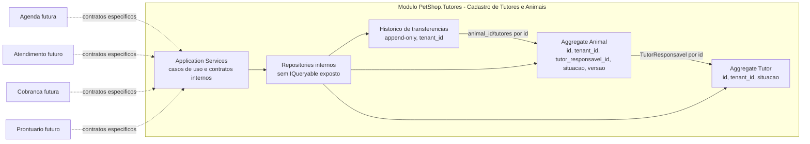

# ADR-0006: Ownership e relacionamento entre tutores e animais

- **Status:** Aceita
- **Data:** 2026-07-21
- **Decisao:** manter o vinculo vigente owned pelo modulo Cadastro de Tutores e Animais, com um tutor responsavel operacional por animal

## Contexto

Os SDDs 12 a 23 consolidaram o modulo `PetShop.Tutores` como a capacidade **Cadastro de Tutores e Animais**. O modulo possui os aggregates `Tutor` e `Animal`, as tabelas `tutores`, `animais` e `historico_transferencias_animais`, endpoints HTTP de cadastro/manutencao e transferencia explicita de responsabilidade.

O SDD 24 revisou cardinalidades, ownership, integridade e contratos para impedir que Agenda, Atendimento, Cobranca ou Prontuario consumam tabelas ou entidades internas do modulo.

## Diagnostico do modelo anterior

O modelo anterior ja expressava corretamente:

- `Tutor` e `Animal` dentro do mesmo Bounded Context inicial;
- `Animal` referenciando o tutor responsavel por identidade, sem navegacao de dominio para `Tutor`;
- FK fisica composta `(tenant_id, tutor_responsavel_id)` para impedir associacao cross-tenant;
- historico minimo append-only para transferencia;
- endpoints sem `tenant_id` como autoridade de cliente;
- superficie publica minima do assembly.

A lacuna encontrada foi a inativacao de tutor: cadastro e transferencia exigiam tutor ativo, mas era possivel inativar um tutor ainda responsavel por animal ativo. Isso deixava um animal ativo com responsavel operacional sem aptidao vigente.

Nao foram encontradas consultas diretas de outro modulo a tabelas de Tutores/Animais, compartilhamento de `DbContext` alheio entre modulos de negocio, exposicao publica de `IQueryable`, ciclos de projeto ou entidades de dominio exportadas como contrato publico.

## Cardinalidade vigente

- Um `Tutor` pode ser responsavel por zero, um ou muitos `Animais` dentro do mesmo tenant.
- Um `Animal` possui exatamente um `TutorResponsavel` vigente em todos os estados atuais.
- A cardinalidade "um tutor para muitos animais" e expressa pela ausencia de unicidade sobre `(tenant_id, tutor_responsavel_id)`.
- A cardinalidade "um tutor responsavel por animal" e expressa por `animais.tutor_responsavel_id NOT NULL` e pelo aggregate `Animal`.
- Nao existe `ResponsavelPrincipal` como conceito separado; na fatia atual, o `TutorResponsavel` vigente cumpre esse papel operacional minimo.
- Vinculo duplicado nao existe como lista ou tabela associativa nesta fatia; transferir para o mesmo tutor e rejeitado.
- Um `Animal` nao fica sem tutor responsavel nos estados `Ativo`, `Inativo` ou `Falecido`.
- `Animal Ativo` exige que o tutor responsavel vigente esteja ativo. Por isso, tutor com animal ativo vinculado nao pode ser inativado antes de transferencia ou inativacao do animal.

## Natureza do vinculo

O vinculo atual e uma referencia de dominio por identidade, representada no aggregate `Animal` pelo Value Object `TutorResponsavel` e persistida como `animais.tutor_responsavel_id`.

Ele nao e Aggregate Root, nao e entidade principal de relacao e nao e tabela associativa. O dado historico existente, `historico_transferencias_animais`, registra eventos de transferencia, mas nao substitui uma modelagem completa de vigencia.

Uma entidade de vinculo so deve ser criada quando houver dados, comportamento, identidade ou ciclo de vida proprios, como multiplos responsaveis simultaneos, papeis, vigencia, suspensao, disputa, consentimento ou auditoria completa de relacoes.

## Ownership

- Cadastro do Tutor: owned pelo modulo `PetShop.Tutores`.
- Cadastro do Animal: owned pelo modulo `PetShop.Tutores`.
- Vinculo vigente: owned pelo aggregate `Animal`, dentro do modulo `PetShop.Tutores`.
- Historico de transferencia: owned pelo modulo `PetShop.Tutores`.
- Validacao de existencia e aptidao do tutor: Application do modulo `PetShop.Tutores`, usando repository interno filtrado pelo tenant atual.
- Autorizacao de nova associacao: endpoint/caso de uso do modulo, com token autenticado, role exigida e tenant resolvido na borda.
- Transferencia: caso de uso `TransferirResponsabilidadeDoAnimal`, alterando `Animal` e gravando historico na mesma transacao local.
- Exposicao a outros modulos: somente por contratos deliberados quando esses modulos existirem, nunca por `DbContext`, entidades EF Core, repository compartilhado ou `IQueryable`.

## Decisao

Manter `Tutor`, `Animal` e o vinculo vigente no mesmo modulo e no mesmo Bounded Context inicial.

O modulo passa a bloquear a inativacao de tutor quando existir animal ativo vinculado ao tutor no tenant atual. Animais inativos ou falecidos podem permanecer com a referencia historica ao tutor, porque a fatia atual nao possui remocao de vinculo nem historico completo de relacoes.

Nao criar neste SDD:

- modulo separado de Tutores ou Animais;
- Aggregate Root de vinculo;
- tabela principal de multiplos responsaveis;
- pessoa generica;
- Shared Kernel de dominio;
- eventos, broker, barramento interno ou projecao sem consumidor;
- contratos publicos de consulta sem modulo consumidor real.

## Integridade referencial

A FK fisica composta entre `animais` e `tutores` permanece porque as tabelas pertencem ao mesmo modulo owner. Ela reforca a integridade do mesmo tenant e nao autoriza acesso direto ao modelo interno por outros modulos.

O modulo owner da migration e o contexto tecnico `PetShopDbContext`, que centraliza migrations do monolito e carrega o mapeamento do modulo por `ConfigurePersistenciaDoModuloTutores`.

Comportamentos:

- cadastro de animal com tutor inexistente ou cross-tenant e rejeitado pela Application e pela FK composta;
- transferencia cross-tenant e tratada como `404` pela Application e protegida por FKs compostas no historico;
- exclusao fisica continua fora dos fluxos comuns, e FKs usam `Restrict`;
- inativacao nao remove dados nem apaga historico;
- inativacao de tutor com animal ativo vinculado e rejeitada;
- inativacao ou falecimento de animal preserva o tutor responsavel como referencia historica minima.

Esta decisao nao exige migration, pois altera regra de Application e documentacao, nao o schema.

## Contratos internos

Enquanto Agenda, Atendimento, Cobranca e Prontuario nao existem, contratos executaveis para esses consumidores nao serao introduzidos. A superficie publica continua minima.

Quando houver consumidor real, os contratos devem ser especificos por caso de uso e carregar o tenant resolvido pela borda confiavel, sem aceitar tenant do cliente como autoridade:

| Necessidade | Contrato minimo esperado | Consistencia |
| --- | --- | --- |
| Verificar se Tutor existe e esta apto | `TutorEstaAptoParaResponsabilidade(tenantId, tutorId)` | Imediata |
| Obter dados minimos de apresentacao do Tutor | `ObterTutorResumo(tenantId, tutorId)` com nome e contatos estritamente necessarios | Imediata ou projecao local se houver alto volume |
| Verificar vinculo vigente | `AnimalPossuiTutorResponsavel(tenantId, animalId, tutorId)` | Imediata |
| Obter responsavel atual do Animal | `ObterResponsavelOperacionalAtual(tenantId, animalId)` | Imediata |
| Transferir responsabilidade | comando explicito no modulo owner | Transacao local |
| Compor consulta para API | endpoint/query do modulo owner ou projection deliberada | Conforme SLA do consumidor |

Esses contratos nao devem expor `IQueryable`, `DbContext`, entidades EF Core, DTOs de infrastructure ou interfaces CRUD genericas.

## Consistencia

Exigem consistencia imediata no modulo `PetShop.Tutores`:

- cadastrar Animal com Tutor responsavel ativo;
- associar Tutor existente ao criar Animal;
- transferir responsabilidade de Animal ativo;
- rejeitar transferencia para mesmo tutor;
- rejeitar transferencia para tutor inativo;
- rejeitar transferencia de animal inativo ou falecido;
- inativar Tutor quando nao houver Animal ativo vinculado;
- inativar ou marcar falecimento de Animal preservando a referencia historica minima.

O acoplamento transacional atual e local ao modulo e ao `PetShopDbContext` tecnico do monolito. Nao ha mensageria nem necessidade de consistencia eventual neste SDD.

## Diagrama

## Matriz de ownership

| Dado ou operacao | Owner | Consumidores | Forma de acesso | Consistencia | Autorizacao | Tenant owner |
| --- | --- | --- | --- | --- | --- | --- |
| Cadastro do Tutor | `PetShop.Tutores` | API de Tutores; futuros modulos por contrato | Application/endpoint do modulo | Imediata | JWT, role e tenant autenticado | `tutores.tenant_id` |
| Cadastro do Animal | `PetShop.Tutores` | API de Animais; futuros modulos por contrato | Application/endpoint do modulo | Imediata | JWT, role e tenant autenticado | `animais.tenant_id` |
| Vinculo vigente | `Animal` em `PetShop.Tutores` | API de Animais; futuros modulos por contrato | `TutorResponsavelId` em response minima ou contrato especifico | Imediata | Modulo owner valida tutor ativo e tenant | `animais.tenant_id` |
| Responsavel principal | Nao existe como dado separado | Nenhum consumidor atual | Equivale ao tutor responsavel vigente nesta fatia | Imediata | Igual ao vinculo vigente | `animais.tenant_id` |
| Transferencia | `PetShop.Tutores` | API de Animais | Caso de uso explicito com versao | Transacao local | JWT, role, tenant e subject autenticado | `historico_transferencias_animais.tenant_id` |
| Consulta composta | `PetShop.Tutores` ate existir outro modulo | API atual; futuros modulos | Endpoint/query do modulo ou projection deliberada | Imediata inicialmente | Tenant autenticado; sem vazamento cross-tenant | Tenant dos registros consultados |

## Impacto em capacidades futuras

- Agenda deve validar animal ativo, situacao que permita agendamento e responsavel operacional atual por contrato, sem inferir consentimento clinico.
- Atendimento deve registrar quem acompanhou, autorizou ou recebeu orientacao como dado do proprio fluxo, podendo consultar o vinculo vigente no momento e gravar snapshot quando necessario.
- Cobranca nao deve tratar `TutorResponsavelId` como pagador. Contratante, responsavel financeiro e pagador exigem discovery proprio.
- Prontuario deve registrar snapshot historico de animal, responsavel, autoria e contexto do atendimento quando esse modulo existir.

## Consequencias

Positivas:

- Mantem o modelo simples e coerente com a fatia vigente.
- Fecha a lacuna de animal ativo com tutor responsavel inativo.
- Preserva isolamento multitenant na Application e no banco.
- Define como futuros consumidores devem se integrar sem acessar persistencia interna.

Custos:

- Inativar tutor pode retornar conflito operacional e exigir transferencia ou inativacao previa dos animais ativos.
- Ainda nao ha historico completo de vigencia de vinculos.
- Futuros modulos precisarao de contratos especificos quando surgirem.

## Estrategia futura para multiplos responsaveis

Quando houver regra confirmada, criar uma tabela tenant-owned de vinculos por migration aditiva, com backfill a partir de `animais.tutor_responsavel_id`, papel explicito, vigencia e constraint para no maximo um responsavel principal vigente por animal.

A coluna atual deve permanecer durante fase de compatibilidade ate que consumidores sejam migrados para contratos novos.

## Condicoes de reavaliacao

Reavaliar esta ADR se:

- um animal precisar de varios responsaveis simultaneos;
- responsavel financeiro, proprietario declarado ou autorizacao clinica tiverem regras confirmadas;
- inativacao de tutor precisar de workflow de transferencia em lote;
- Agenda, Atendimento, Cobranca ou Prontuario precisarem de leitura frequente com SLA proprio;
- o historico de transferencia deixar de ser suficiente para auditoria ou vigencia.

## Relacao com codigo, testes e documentacao

- Codigo: `src/Modules/Tutores/PetShop.Tutores/Application/TutoresApplicationService.cs`
- Codigo: `src/Modules/Tutores/PetShop.Tutores/Application/ITutoresRepository.cs`
- Codigo: `src/Modules/Tutores/PetShop.Tutores/Infrastructure/TutoresRepository.cs`
- API: `src/Modules/Tutores/PetShop.Tutores/Api/ModuloTutoresEndpointRouteBuilderExtensions.cs`
- Testes: `tests/PetShop.IntegrationTests/TutoresApiTests.cs`
- Testes: `tests/PetShop.IntegrationTests/AnimaisPersistenceTests.cs`
- Testes: `tests/PetShop.ArchitectureTests/TutoresModuleBoundaryTests.cs`
- Documentacao: `docs/domain/tutores-e-animais.md`
