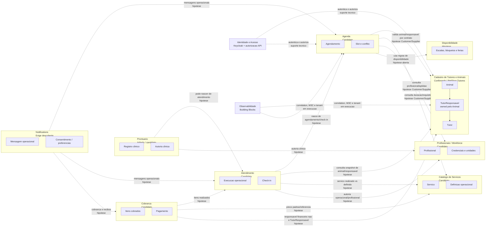

# Context Map

- **Data:** 2026-07-21
- **Escopo:** SDD 26

## Mapa Mermaid

## Contextos confirmados

| Contexto | Modulo atual | Status | Linguagem publicada |
| --- | --- | --- | --- |
| Cadastro de Tutores e Animais | `PetShop.Tutores` | Confirmado | Endpoints HTTP de Tutores/Animais e documentacao de dominio; sem contrato interno para outros modulos ainda. |
| Identidade e Acesso | Keycloak local + `PetShop.Api.Authentication` | Confirmado como suporte tecnico | Claims validadas, role `petshop.access`, `tenant_id`; nao e modelo de Profissional. |
| Observabilidade | `PetShop.Observability` e adapter ASP.NET Core | Confirmado como building block tecnico | Headers canonicos, correlation e W3C; nao e bounded context de negocio. |

## Contextos candidatos

| Contexto | Status | Upstream provavel | Downstream provavel | Observacao |
| --- | --- | --- | --- | --- |
| Catalogo de Servicos | Candidato | Produto/operacao do tenant | Agenda, Atendimento, Cobranca | Deve publicar definicao operacional minima; preco definitivo pode pertencer a Cobranca. |
| Profissionais / Workforce | Candidato | Gestao operacional/RH do tenant | Agenda, Atendimento, Prontuario | Nao confundir profissional com usuario autenticado. |
| Disponibilidade | Hipotese aberta | Workforce ou Agenda | Agenda | Decisao depende de quem altera e quais invariantes precisam consistencia. |
| Agenda | Candidato | Tutores/Animais, Catalogo, Workforce | Atendimento, Notifications, Cobranca | Deve controlar reserva, conflito e ciclo de agendamento. |
| Atendimento | Candidato | Agenda, Catalogo, Workforce, Tutores/Animais | Prontuario, Cobranca, Notifications | Pode ser adiado ate existir execucao operacional real. |
| Prontuario | Adiado / candidato forte | Atendimento, Workforce, Tutores/Animais | Auditoria, exportacao futura | Evidencias clinicas ainda faltam. |
| Cobranca | Candidato | Catalogo, Atendimento, Tutores/Animais | Notifications, relatorios | Nao inferir pagador de TutorResponsavel. |
| Notifications | Exige descoberta | Agenda, Atendimento, Cobranca | Canais externos | Pode iniciar como adapter tecnico; consentimento/templates podem virar dominio. |
| Auditoria | Adiado | Todos os fluxos criticos | Compliance/suporte | Historicos pontuais nao substituem auditoria funcional ampla. |
| Assinaturas SaaS | Adiado | Produto SaaS | Billing da plataforma | Diferente da cobranca operacional do petshop. |

## Relacoes classificadas

| Relacao | Classificacao | Evidencia | Direcao |
| --- | --- | --- | --- |
| API -> `PetShop.Tutores` | Composition Root / Open Host local do monolito | `Program.cs`, `AddModuloTutores`, `MapModuloTutores` | API compoe modulo. |
| `PetShop.Tutores` -> `PetShopDbContext` | Adaptacao tecnica interna ao monolito | repositories internos recebem `DbContext` registrado pela API | Modulo usa contexto tecnico por contrato de composicao. |
| `Animal` -> `Tutor` | Relacao interna ao mesmo bounded context | FK composta e `TutorResponsavel` por id | Mesmo modulo owner. |
| Futuros modulos -> `PetShop.Tutores` | Hipotese Customer/Supplier | ADR-0006 lista contratos futuros | Downstream deve consumir contrato especifico. |
| Agenda -> Catalogo/Workforce/Disponibilidade | Hipotese | Nenhum codigo; necessidade de reserva futura | A classificar no SDD correspondente. |
| Atendimento -> Agenda | Hipotese | Check-in e inicio de execucao ainda nao implementados | A classificar por discovery. |
| Cobranca -> Atendimento/Catalogo | Hipotese | Valor cobrado depende de contratado/realizado | A classificar por discovery. |

## Pontos de composicao

- API: `src/Apps/PetShop.Api/Program.cs`.
- Persistencia: `PetShopDbContext.OnModelCreating` chama `ConfigurePersistenciaDoModuloTutores`.
- Modulo: `AddModuloTutores<TDbContext>` recebe tenant e subject resolvidos na borda.
- Endpoints: `MapModuloTutores` publica rotas `/tutores` e `/animais`.

## Areas de incerteza

- owner de disponibilidade;
- limite entre check-in, agenda e atendimento;
- responsavel financeiro versus tutor operacional;
- quando criar contracts internos executaveis;
- quando trocar `PetShopDbContext` tecnico por contexts por modulo;
- se Notifications sera adapter, modulo de comunicacao ou bounded context;
- se Prontuario deve ser separado de Atendimento ja no primeiro fluxo clinico.
