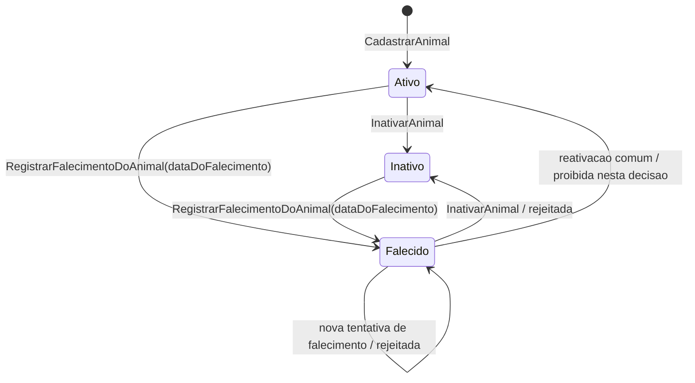

# Refinamento do ciclo de vida do Animal

- **Data:** 2026-07-21
- **Escopo:** SDD 23
- **Modulo analisado:** `PetShop.Tutores`

## Objetivo

Registrar a revisao do aggregate `Animal` na capacidade **Cadastro de Tutores e Animais**, separando dados cadastrais, situacao operacional e hipoteses clinicas futuras sem antecipar Prontuario, Atendimento, Agenda ou Cobranca.

## Inspecao realizada

### Historico e documentos

- A branch de trabalho nao e `main`.
- O historico recente contem os commits posteriores ao SDD 12: fronteira de Tutores e Animais, fundacao do modulo, dominio/persistencia/API de tutores, dominio/persistencia/API de animais, transferencia de responsabilidade, validacao da fatia vertical e refinamento de responsabilidades do SDD 22.
- Foram revisados `README.md`, ADRs 0001 a 0004, `docs/domain/tutores-e-animais.md`, `docs/domain/refinamento-responsabilidades-tutores-animais.md`, solution, props, migrations, modulo `PetShop.Tutores` e testes unitarios, HTTP, persistencia e arquitetura.

### Modelo anterior encontrado

- `Animal` era Aggregate Root interno do modulo `PetShop.Tutores`.
- `AnimalId` era o identificador tecnico; nao existiam identificadores externos.
- `TenantId` era imutavel e vinha da borda autenticada.
- `TutorResponsavel` era uma referencia operacional por identidade ao tutor responsavel vigente.
- Dados cadastrais: nome, especie, raca opcional, sexo, data de nascimento exata opcional, cor ou pelagem opcional e observacao cadastral opcional.
- `SituacaoDoAnimal` possuia apenas `Ativo` e `Inativo`.
- `Inativar` era a unica operacao de ciclo de vida alem da transferencia de responsabilidade.
- A transferencia exigia animal ativo, novo tutor ativo, novo tutor diferente e versao atual.
- A tabela `animais` tinha `tenant_id NOT NULL`, query filter por tenant e FK composta `(tenant_id, tutor_responsavel_id)`.

## Diagnostico

### Identidade

`AnimalId` permanece como identificador tecnico interno e nao deve ser confundido com identificador clinico, codigo cadastral visivel ou microchip.

Microchip foi analisado e permanece fora da fatia atual. Ainda nao ha requisito para captura, busca, unicidade global, unicidade por tenant, validacao contra base externa ou multiplos identificadores. Criar um sistema generico de identificadores agora aumentaria contrato e schema sem comportamento confirmado.

### Dados cadastrais

- `NomeDoAnimal` pertence ao aggregate e continua obrigatorio.
- `Especie` pertence ao aggregate e continua obrigatoria como texto validado por Value Object simples.
- `Raca` pertence ao cadastro basico, mas continua opcional e textual; catalogo e validacao especie-raca ficam adiados.
- `SexoDoAnimal` continua com `NaoInformado`, `Macho` e `Femea`, sem regras reprodutivas por especie.
- `DataDeNascimento` continua opcional e exata quando informada.
- `CorOuPelagem` continua opcional e cadastral.
- `ObservacaoCadastral` continua opcional e operacional; nao deve virar prontuario, alergia, diagnostico ou historico clinico.

### Data de nascimento e idade estimada

A data de nascimento pode ser desconhecida e isso continua representado por `null`.

O modelo nao aceita mes/ano nem idade aproximada nesta fatia, porque o contrato atual so recebe `DateOnly`. Persistir idade derivada ou fabricar um dia aproximado criaria falsa precisao. Quando houver requisito de idade aproximada, deve ser criado um conceito proprio que carregue precisao e fonte da informacao.

### Especie e raca

`Especie` e `Raca` continuam textuais. O MVP nao precisa de catalogo global, catalogo por tenant ou validacao especie-raca. Animal sem raca definida continua representavel por texto informado, como `SRD`, ou por ausencia de raca quando a clinica nao quiser registrar.

### Situacao e ciclo de vida

O modelo anterior usava `Inativo` como unico estado nao operacional. Isso era insuficiente para o proximo desenho de Agenda e Atendimento, porque falecimento nao e uma simples inativacao cadastral.

Estados aprovados agora:

| Estado | Significado | Efeito operacional |
| --- | --- | --- |
| `Ativo` | Animal cadastrado e operacionalmente disponivel. | Pode ser consultado, atualizado cadastralmente e transferido de responsavel. Agenda futura podera permitir novos agendamentos. |
| `Inativo` | Cadastro retirado de uso comum por motivo administrativo ou operacional nao especificado. | Nao pode transferir responsabilidade. Agenda futura nao deve permitir novos agendamentos comuns. |
| `Falecido` | Falecimento informado ao cadastro operacional, com data obrigatoria. | Nao pode transferir responsabilidade, ser inativado ou sofrer alteracao cadastral comum. Agenda e Atendimento futuros devem bloquear novos fluxos incompatveis. |

Estados adiados:

- `Desaparecido`: relevante, mas ainda sem fluxo confirmado de marcação, reaparecimento, comunicacao com tutor ou impacto em agenda.
- `Duplicado` e `Arquivado`: dependem de deduplicacao, merge, auditoria e regras administrativas futuras.

## Transicoes

## Invariantes adotadas

- `AnimalId`, `TenantId` e tutor responsavel nao mudam por atualizacao cadastral comum.
- O tenant do animal continua vindo exclusivamente da claim validada.
- Animal deve pertencer a exatamente um tenant.
- Animal continua vinculado a tutor responsavel do mesmo tenant por FK composta.
- `Falecido` exige `DataDoFalecimento`.
- `DataDoFalecimento` so pode existir quando a situacao for `Falecido`.
- `DataDoFalecimento` nao pode estar no futuro.
- Animal falecido nao aceita alteracao cadastral comum, inativacao ou transferencia de responsabilidade.
- Transferencia de responsabilidade continua exigindo animal ativo.
- Idade nao e persistida como dado derivado.

## Conceitos fora do aggregate nesta fatia

- Alergias, alertas clinicos, classificacao de risco, historico de peso, diagnosticos, prescricoes e vacinas pertencem a Atendimento ou Prontuario.
- Restricoes de manejo podem virar dado operacional minimo no futuro, mas ainda nao possuem requisito suficiente para coluna ou Value Object.
- Microchip e outros identificadores externos permanecem hipoteses.
- Status reprodutivo e controle de reproducao permanecem fora do MVP.

## Impacto futuro

Agenda podera consultar uma visao resumida de animal e bloquear novos agendamentos quando a situacao nao for `Ativo`, especialmente `Falecido`.

Atendimento e Prontuario deverao tratar falecimento clinico, declaracao de obito, anexos, evidencias e correcoes auditadas como responsabilidade propria, nao como campos simples do cadastro.

Cobranca nao deve inferir de `TutorResponsavel` nem de `Falecido` regras financeiras retroativas; qualquer cobranca futura precisa de workflow proprio.

## Hipoteses e questoes em aberto

- Se a clinica precisara registrar apenas mes/ano ou idade aproximada.
- Se microchip sera unico globalmente, por tenant ou apenas informativo.
- Se desaparecimento precisa de fluxo reversivel com data, motivo e comunicacao.
- Se correcoes de falecimento exigirao auditoria funcional propria.
- Se Agenda precisara de projection local para animal ativo/falecido.
