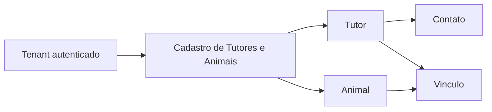

# Tutores e Animais

## Objetivo

Registrar a linguagem ubiqua, as responsabilidades e a fronteira inicial da primeira fatia de negocio da plataforma: cadastro e manutencao de tutores, animais e seus vinculos dentro de uma clinica veterinaria.

Este documento orienta e consolida a Entrega 1. As primeiras secoes registram linguagem e fronteira; as secoes posteriores documentam as entidades, tabelas, endpoints, contratos HTTP e decisoes fisicas efetivamente introduzidas pelos SDDs 13 a 20.

## Decisao de fronteira

Tutores e Animais pertencem ao mesmo Bounded Context inicial: **Cadastro de Tutores e Animais**.

Na implementacao inicial, a recomendacao e materializar essa capacidade como um unico modulo de negocio, com linguagem interna em portugues e ownership unico dos dados de tutores, animais, contatos e vinculos. Nao ha evidencia suficiente para criar dois Bounded Contexts, dois DbContexts, dois schemas, dois repositories independentes ou contratos formais entre Tutores e Animais nesta fase.

Entre as alternativas da SDD, a separacao em Bounded Contexts distintos esta rejeitada. A possibilidade de dois modulos internos no mesmo Bounded Context fica tratada como decisao fisica futura, nao como requisito inicial.

A separacao futura em modulos ou Bounded Contexts distintos fica adiada ate existir evidencia de linguagem, regras, ownership, ciclo de vida, caracteristicas de seguranca ou ritmo de mudanca realmente divergentes.

## Glossario

| Termo | Status | Significado |
| --- | --- | --- |
| Tutor | Fato confirmado | Pessoa cadastrada pela clinica para relacionamento operacional sobre animais dentro do tenant. Nao implica propriedade legal, responsabilidade financeira, consentimento clinico amplo ou autorizacao de retirada. |
| Animal | Fato confirmado | Paciente animal atendido pela clinica e mantido no cadastro operacional do tenant. |
| Tutor responsavel | Decisao vigente | Tutor ativo, existente e visivel no tenant atual que representa a responsabilidade operacional vigente pelo animal na fatia atual. |
| Vinculo com o animal | Decisao vigente | Relacao operacional atual entre um animal e seu tutor responsavel. Hoje e persistida em `animais.tutor_responsavel_id`; nao possui entidade propria nem multiplos papeis simultaneos. |
| Responsavel | Hipotese | Termo amplo para pessoa que exerce alguma responsabilidade sobre o animal. Deve ser refinado por papel antes de virar contrato ou entidade. |
| Responsavel principal | Termo reservado | Papel a ser usado somente se houver multiplos responsaveis simultaneos e uma regra exigir destaque operacional. Na fatia atual equivale, na pratica, ao tutor responsavel vigente, mas nao existe como conceito separado no codigo. |
| Proprietario declarado | Hipotese | Pessoa declarada como proprietaria do animal. Nao e validada nem inferida a partir de `Tutor` nesta etapa. |
| Responsavel financeiro | Hipotese | Pessoa ou organizacao que assume cobrancas. Nao e inferida a partir de `Tutor` e fica reservada para discovery de Cobranca. |
| Contato | Fato confirmado | Canal de comunicacao do tutor, como telefone ou e-mail. |
| Situacao | Fato confirmado | Estado operacional de tutor ou animal. Para Animal, atualmente `ativo`, `inativo` ou `falecido`. |
| Animal ativo | Decisao vigente | Animal cadastrado e operacionalmente disponivel para fluxos comuns. |
| Animal inativo | Decisao vigente | Animal retirado do uso comum por motivo administrativo ou operacional nao especificado, sem hard delete. |
| Animal falecido | Decisao vigente | Animal com falecimento registrado no cadastro operacional, com data obrigatoria e sem novos fluxos comuns incompativeis. |
| Animal desaparecido | Hipotese | Situacao operacional relevante, mas adiada ate existir fluxo de marcacao, reaparecimento e impacto em agenda. |
| Especie | Decisao vigente | Classificacao textual obrigatoria do animal no cadastro basico, sem catalogo neste MVP. |
| Raca | Decisao vigente | Informacao textual opcional; pode representar raca informada, `SRD` ou ficar ausente. |
| Idade estimada | Hipotese | Informacao aproximada ainda nao implementada. A idade nao e persistida como dado derivado. |
| Identificador externo | Hipotese | Codigo ou identificador diferente do `AnimalId` tecnico; nao implementado nesta fatia. |
| Microchip | Hipotese | Possivel identificador externo futuro; sem regra atual de unicidade global, por tenant ou informativa. |
| Transferencia de responsabilidade | Decisao vigente | Operacao explicita que altera o tutor responsavel vigente de um animal ativo para outro tutor ativo do mesmo tenant, com concorrencia por `versao` e historico minimo append-only. |

## Termos aceitos e evitados

Termos aceitos na linguagem de dominio:

- `Tutor`;
- `Animal`;
- `Vinculo`;
- `Contato`;
- `Responsavel principal`, quando a regra exigir;
- `Situacao`, quando a regra exigir;
- `CadastrarTutor`;
- `CadastrarAnimal`;
- `VincularAnimalAoTutor`;
- `TransferirResponsabilidadeDoAnimal`.

Termos evitados:

- `Customer`, `Client`, `PetOwner` ou `Owner` para representar tutor;
- `Pet`, quando o conceito do dominio for paciente animal;
- `CreateTutorCommand`, `UpdateAnimalHandler` ou nomes mistos em ingles para casos de uso de dominio;
- `Responsavel financeiro`, sem requisito especifico;
- `Proprietario legal`, como sinonimo automatico de tutor;
- `Shared`, `Common` ou `Core` para compartilhar conceitos de dominio por conveniencia.

Termos tecnicos consolidados podem permanecer em ingles quando representarem infraestrutura ou padroes de codigo, como `Domain`, `Application`, `Infrastructure`, `Controller`, `DbContext`, `Repository`, `Handler`, `Request` e `Response`.

## Responsabilidades

O Bounded Context Cadastro de Tutores e Animais e responsavel por:

- cadastrar, consultar, pesquisar, atualizar e inativar tutores;
- registrar e manter contatos de tutores conforme necessidade do fluxo;
- cadastrar, consultar, pesquisar, atualizar e inativar animais;
- manter o vinculo entre tutor e animal;
- transferir a responsabilidade por um animal somente mediante confirmacao explicita;
- garantir que tutor, animal e vinculo pertencam ao tenant autenticado;
- tratar dados de outro tenant como inexistentes nos fluxos comuns;
- expor contratos publicos futuros orientados a casos de uso, sem expor entidades de dominio ou persistencia.

Nao pertencem a esta fronteira nesta etapa:

- prontuario;
- atendimento;
- vacinacao;
- exames;
- medicamentos;
- agenda;
- faturamento;
- estoque;
- convenio;
- guarda compartilhada;
- pedigree;
- historico clinico.

## Ownership dos dados

O modulo Cadastro de Tutores e Animais sera o owner dos dados funcionais que representem:

- tutores;
- contatos de tutores;
- animais;
- vinculos entre tutores e animais;
- situacao operacional de tutor ou animal, se introduzida.

Quando esses dados forem persistidos, todas as tabelas funcionais devem possuir `tenant_id NOT NULL`, conforme a ADR-0001. Unicidades locais ao tenant devem incluir `tenant_id`, e relacionamentos entre tutor, animal e vinculo devem impedir associacao cruzada entre tenants.

Outros modulos nao devem consultar diretamente tabelas, entidades EF Core, `DbContext` ou repositories desse modulo. Necessidades futuras de agenda, atendimento, faturamento ou notificacao devem usar contratos deliberados, projecoes locais ou workflows definidos quando a funcionalidade existir.

## Fundacao tecnica inicial

O SDD 13 materializa a fronteira como um unico assembly de modulo:

```text
src/Modules/Tutores/PetShop.Tutores/
```

Essa fundacao usa pastas conceituais `Domain`, `Application`, `Infrastructure` e `Api`, mas preserva superficie publica minima. A API carrega o modulo somente pelos pontos de composicao `AddModuloTutores` e `MapModuloTutores`.

O SDD 15 persiste `Tutor` em PostgreSQL usando o `PetShopDbContext` tecnico da API como contexto de migration do monolito e mapeamento localizado no modulo `PetShop.Tutores`.

O SDD 16 adiciona os casos de uso e contratos HTTP de Tutores no mesmo assembly do modulo. A API continua carregando o modulo pelos pontos de composicao `AddModuloTutores` e `MapModuloTutores`, informando ao modulo o `DbContext` tecnico e o tenant autenticado resolvido na borda.

O SDD 17 introduz o modelo de dominio inicial de `Animal`, ainda sem persistencia, endpoints, repository, consulta direta a `Tutor`, vinculos completos ou eventos de integracao.

O SDD 18 persiste `Animal` em PostgreSQL no mesmo modulo e cria o vinculo inicial com `Tutor` por `TutorResponsavel`.

O SDD 20 adiciona o caso de uso explicito `TransferirResponsabilidadeDoAnimal`, preservando o mesmo Bounded Context e o mesmo ownership de dados.

O SDD 24 revisa relacionamentos, cardinalidades e ownership entre Tutores e Animais. A decisao resultante fica registrada na ADR-0006 e mantem o vinculo vigente owned pelo modulo Cadastro de Tutores e Animais.

## Invariantes conhecidas

- Tutor, animal e vinculo sempre pertencem a exatamente um tenant autenticado.
- O tenant nao pode ser informado pelo cliente como autoridade em body, rota, query string ou header.
- Dados de outro tenant devem se comportar como inexistentes para operacoes comuns.
- Um animal nao deve ser vinculado a tutor de outro tenant.
- Um animal novo deve ser vinculado a tutor responsavel ativo.
- Um tutor com animal ativo vinculado nao pode ser inativado antes de transferencia ou inativacao do animal.
- A transferencia de responsabilidade de um animal exige confirmacao explicita.
- A transferencia de responsabilidade so ocorre para animal ativo e novo tutor responsavel ativo.
- Falecimento de animal e uma transicao explicita, exige data de falecimento e nao equivale a inativacao cadastral.
- Animal falecido nao pode ter cadastro comum alterado, ser inativado ou ter responsabilidade transferida.
- Inativar tutor ou animal nao deve apagar historico futuro de atendimento ou faturamento, quando esses contextos existirem.
- O conceito de tutor nao presume propriedade legal do animal.
- Responsavel financeiro nao deve ser inferido a partir do tutor sem requisito de negocio.

## Modelo inicial de Tutor

O SDD 14 introduz `Tutor` como Aggregate Root inicial do modulo Cadastro de Tutores e Animais. O modelo permanece somente no Domain, sem EF Core, endpoints, DTOs HTTP, repositories ou eventos de dominio.

Identidade e tenant sao imutaveis por instancia. O `TenantId` do dominio e um identificador forte local ao modulo; a conversao a partir da claim autenticada continua sendo responsabilidade futura da borda/Application, conforme a ADR-0001.

Campos e regras iniciais:

- `TutorId` e `TenantId` sao obrigatorios e baseados em `Guid`;
- `NomeDoTutor` e obrigatorio e remove espacos externos;
- `Cpf` e opcional, mas deve ter digitos verificadores validos quando informado;
- `Email` e `Telefone` sao opcionais individualmente, mas o tutor deve possuir ao menos um contato operacional;
- `Telefone` aceita DDD brasileiro com 10 ou 11 digitos, com formatacao comum e opcionalmente `+55`;
- tutor nasce com `SituacaoDoTutor.Ativo`;
- inativacao muda a situacao para inativo, registra `InativadoEm` e atualiza `AtualizadoEm`;
- alteracoes de cadastro preservam identidade, tenant e `CriadoEm`, e atualizam `AtualizadoEm`.

CPF, e-mail e telefone sao dados pessoais do tutor. O modelo nao registra logs nem eventos com documento completo nesta etapa. Finalidade, retencao, mascaramento em contratos HTTP e fluxos de direitos do titular continuam pendentes para os SDDs que criarem persistencia, API ou exportacao desses dados.

## Modelo inicial de Animal

O SDD 17 introduz `Animal` como Aggregate Root inicial para o paciente atendido pela clinica dentro do mesmo Bounded Context Cadastro de Tutores e Animais.

O modelo permanece somente no Domain, sem EF Core, endpoints, DTOs HTTP, repositories, eventos de dominio ou contratos entre modulos. `Animal` nao carrega nem consulta o aggregate `Tutor`; ele guarda a referencia operacional pelo Value Object `TutorResponsavel`, baseado no identificador do tutor responsavel. A validacao de existencia do tutor e de associacao no mesmo tenant pertence aos casos de uso futuros que tiverem acesso a persistencia.

Identidade e tenant sao imutaveis por instancia. O `TenantId` permanece o identificador forte local ao modulo e continua vindo da borda autenticada quando houver Application/API.

Campos e regras iniciais:

- `AnimalId`, `TenantId` e `TutorResponsavel` sao obrigatorios e baseados em `Guid`;
- `NomeDoAnimal` e obrigatorio e remove espacos externos;
- `Especie` e obrigatoria e modelada como Value Object textual simples, nao como catalogo;
- `Raca` e opcional e tambem textual, evitando catalogo completo sem requisito;
- `SexoDoAnimal` aceita `NaoInformado`, `Macho` ou `Femea`;
- `DataDeNascimento` e opcional, mas nao pode estar no futuro quando informada;
- `DataDoFalecimento` existe somente para animal falecido, e nao pode estar no futuro;
- `CorOuPelagem` e `ObservacaoCadastral` sao opcionais e removem espacos externos quando usadas;
- animal nasce com `SituacaoDoAnimal.Ativo`;
- inativacao muda a situacao para inativo, registra `InativadoEm` e atualiza `AtualizadoEm`;
- falecimento muda a situacao para falecido, registra `DataDoFalecimento` e atualiza `AtualizadoEm`;
- alteracoes de cadastro preservam identidade, tenant, tutor responsavel e `CriadoEm`, e atualizam `AtualizadoEm`.

A decisao por `Especie` e `Raca` textuais reduz complexidade inicial e evita criar catalogos de especies ou racas antes de existir regra de negocio, curadoria ou ownership claro para esses dados.

O SDD 23 mantem idade estimada, microchip, desaparecimento, deduplicacao e alertas clinicos fora do codigo. Idade continua calculavel a partir de `DataDeNascimento` quando houver data exata; quando a data for desconhecida, o cadastro nao fabrica precisao.

## Persistencia inicial de Tutor

O SDD 15 introduz a tabela funcional `tutores`, owned pelo modulo Cadastro de Tutores e Animais.

Colunas:

- `id`;
- `tenant_id NOT NULL`;
- `nome`;
- `documento`;
- `email`;
- `telefone`;
- `situacao`;
- `criado_em`;
- `atualizado_em`;
- `inativado_em`.

Decisoes:

- CPF e persistido normalizado em `documento`.
- CPF e unico somente dentro do tenant por `(tenant_id, documento)`.
- O mesmo CPF pode existir em tenants diferentes.
- `TutorId`, `TenantId`, `NomeDoTutor`, `Cpf`, `Email`, `Telefone` e `SituacaoDoTutor` usam conversoes EF Core no mapeamento do modulo.
- Consultas comuns usam query filter por tenant atual.
- Escritas usam guarda em `SaveChanges` para exigir tenant resolvido e impedir alteracao de tutor pertencente a outro tenant.
- Sem tenant resolvido, dados de tutores nao devem ser materializados por consultas comuns.
- A inativacao de tutor e rejeitada quando existir animal ativo vinculado no tenant atual, preservando a aptidao do `TutorResponsavel` vigente.

Trade-off registrado:

- Foi mantido um unico `PetShopDbContext` tecnico para migrations do banco compartilhado do monolito, carregando uma extensao publica de persistencia do modulo. Isso evita criar outro contexto/migration history antes de haver necessidade, mas exige que a API conheca o ponto de composicao EF do modulo. A entidade `Tutor` permanece interna ao modulo e o Domain continua sem dependencia de EF Core, ASP.NET Core, JWT, claims ou `HttpContext`.

Privacidade:

- CPF, e-mail e telefone sao dados pessoais. Nesta etapa eles sao persistidos para finalidade operacional de cadastro e contato do tutor pela clinica dentro do tenant.
- A API de Tutores retorna CPF somente como `cpfMascarado`; pesquisa por CPF aceita valor formatado ou normalizado, mas nao devolve o documento completo.
- Listagens minimizam dados e retornam somente `tutorId`, `nome`, `cpfMascarado` e `situacao`.
- Ainda nao foram definidos retencao, exportacao, eliminacao, bloqueio ou fluxos de direitos do titular, pois nao ha API publica para esses processos nesta fatia.

## Persistencia inicial de Animal

O SDD 18 introduz a tabela funcional `animais`, owned pelo mesmo modulo Cadastro de Tutores e Animais.

Colunas:

- `id`;
- `tenant_id NOT NULL`;
- `nome`;
- `especie`;
- `raca`;
- `sexo`;
- `data_de_nascimento`;
- `data_do_falecimento`;
- `cor_ou_pelagem`;
- `observacao_cadastral`;
- `situacao`;
- `tutor_responsavel_id`;
- `versao`;
- `criado_em`;
- `atualizado_em`;
- `inativado_em`.

Decisoes:

- `Animal` permanece no mesmo Bounded Context e no mesmo ownership de `Tutor`, conforme ADR-0003.
- O vinculo inicial usa referencia por identidade (`TutorResponsavel`) e e persistido em `tutor_responsavel_id`.
- Foi adotada foreign key fisica composta de `animais (tenant_id, tutor_responsavel_id)` para `tutores (tenant_id, id)`, pois Tutor e Animal pertencem ao mesmo modulo owner nesta fase.
- Essa FK composta impede associacao cross-tenant no banco. Um tutor de outro tenant nao satisfaz a constraint e, na Application, a consulta filtrada por tenant o trata como inexistente.
- A tabela `tutores` recebeu a alternate key `(tenant_id, id)` apenas para suportar a FK composta; o ownership continua no mesmo modulo.
- `AnimalId`, `TenantId`, `TutorId`, `NomeDoAnimal`, `Especie`, `Raca`, `DataDeNascimento`, `CorOuPelagem`, `ObservacaoCadastral`, `SexoDoAnimal` e `SituacaoDoAnimal` usam conversoes EF Core no mapeamento do modulo.
- `DataDoFalecimento` usa conversao EF Core e constraint para existir somente quando a situacao do animal for `Falecido`.
- `versao` e usada como token de concorrencia otimista para alteracoes do animal.
- Consultas comuns usam query filter por tenant atual.
- Escritas usam guarda de `SaveChanges` para exigir tenant resolvido e impedir alteracao de animal pertencente a outro tenant.
- Nao foram criados cache, broker, duplicacao de dados completos do tutor nem contrato entre modulos.

## Transferencia de responsabilidade do Animal

O SDD 20 implementa `TransferirResponsabilidadeDoAnimal` como caso de uso explicito. A transferencia nao acontece pelo endpoint generico de atualizacao do animal.

Rota:

| Metodo | Rota | Uso |
| --- | --- | --- |
| `POST` | `/animais/{animalId}/transferencias-de-responsabilidade` | Transfere o animal para outro tutor responsavel do mesmo tenant. |

Request:

- `novoTutorId`;
- `versao`;
- `motivo`, opcional.

Regras:

- `animalId` vem da rota;
- o tenant vem exclusivamente da claim validada;
- o novo tutor deve existir no tenant atual;
- dados de outro tenant se comportam como inexistentes;
- o animal deve estar ativo;
- o novo tutor deve estar ativo;
- o novo tutor deve ser diferente do tutor atual;
- `versao` deve corresponder a versao atual do animal, protegendo contra lost update;
- `PUT /animais/{animalId}` continua preservando `tutorResponsavelId`.

Historico:

- a tabela `historico_transferencias_animais` registra `tenant_id`, `animal_id`, `tutor_anterior_id`, `tutor_novo_id`, `realizada_em`, `subject` e `motivo` opcional;
- o registro e append-only nos fluxos comuns;
- nao sao registrados token, claims completas, CPF, e-mail, telefone ou nome do tutor;
- o historico usa FKs compostas com `tenant_id` para impedir associacao cross-tenant.

## API de Tutor

Rotas implementadas no SDD 16:

| Metodo | Rota | Uso |
| --- | --- | --- |
| `POST` | `/tutores` | `CadastrarTutor`; retorna `201 Created` com `Location`. |
| `GET` | `/tutores/{tutorId}` | `ConsultarTutorPorId`; outro tenant recebe `404`. |
| `PUT` | `/tutores/{tutorId}` | `AtualizarTutor`; `tutorId` vem da rota e o tenant vem da claim validada. |
| `GET` | `/tutores` | `PesquisarTutores`; suporta pagina limitada, nome, CPF normalizado, situacao e ordenacao estavel. |
| `POST` | `/tutores/{tutorId}/inativacao` | `InativarTutor`; nao realiza hard delete. |

Contratos HTTP sao separados do Domain. Requests nao aceitam `tenant_id` nem `id` como autoridade; membros JSON nao mapeados sao rejeitados pelo contrato fechado da API. Todos os endpoints exigem JWT Bearer com `tenant_id` valido e role minima `petshop.access`.

Pesquisa:

- `pagina`: padrao `1`;
- `tamanhoPagina`: padrao `20`, maximo `100`;
- `nome`: filtro textual;
- `cpf`: filtro por CPF normalizado;
- `situacao`: `ativo` ou `inativo`;
- `ordenarPor`: `nome` ou `criadoEm`;
- `direcao`: `asc` ou `desc`.

## API de Animal

Rotas implementadas ate o SDD 23:

| Metodo | Rota | Uso |
| --- | --- | --- |
| `POST` | `/animais` | `CadastrarAnimal`; valida tutor responsavel no tenant atual e retorna `201 Created` com `Location`. |
| `GET` | `/animais/{animalId}` | `ConsultarAnimalPorId`; outro tenant recebe `404`. |
| `PUT` | `/animais/{animalId}` | `AtualizarAnimal`; `animalId` vem da rota, o tenant vem da claim validada e o tutor responsavel nao e alterado. |
| `GET` | `/animais` | `PesquisarAnimais`; suporta pagina limitada, nome, tutor responsavel, especie, situacao e ordenacao estavel. |
| `POST` | `/animais/{animalId}/transferencias-de-responsabilidade` | `TransferirResponsabilidadeDoAnimal`; exige novo tutor ativo do mesmo tenant e versao atual do animal. |
| `POST` | `/animais/{animalId}/falecimento` | `RegistrarFalecimentoDoAnimal`; exige `dataDoFalecimento` e marca o animal como falecido. |
| `POST` | `/animais/{animalId}/inativacao` | `InativarAnimal`; nao realiza hard delete. |

Contratos HTTP sao separados do Domain e nao expoem entidades de dominio ou persistencia. Requests de animais nao aceitam `tenant_id`, `id` nem troca de `tutorResponsavelId` na atualizacao como autoridade. Todos os endpoints exigem JWT Bearer com `tenant_id` valido e role minima `petshop.access`.

Cadastro valida o tutor responsavel por consulta filtrada no tenant atual. Tutor inexistente ou pertencente a outro tenant retorna `404`, sem revelar existencia cross-tenant. Tutor inativo retorna conflito porque nao pode assumir novo vinculo operacional. Respostas de animais retornam `tutorResponsavelId`, mas nao duplicam nome, CPF, e-mail, telefone ou outros dados pessoais do tutor.

Pesquisa:

- `pagina`: padrao `1`;
- `tamanhoPagina`: padrao `20`, maximo `100`;
- `nome`: filtro textual;
- `tutorResponsavelId`: filtro por tutor responsavel no tenant atual;
- `especie`: filtro textual normalizado pelo Value Object `Especie`;
- `situacao`: `ativo`, `inativo` ou `falecido`;
- `ordenarPor`: `nome` ou `criadoEm`;
- `direcao`: `asc` ou `desc`.

## Fluxos da Entrega 1

Fluxos minimos de tutor:

- cadastrar tutor;
- consultar tutor;
- atualizar tutor;
- pesquisar tutores;
- inativar tutor.

Fluxos minimos de animal:

- cadastrar animal;
- consultar animal;
- atualizar animal;
- pesquisar animais;
- inativar animal.

Fluxos de vinculo:

- vincular animal a tutor;
- transferir responsabilidade do animal somente apos confirmacao explicita.

Todos os fluxos persistentes da Entrega 1 devem validar isolamento com pelo menos dois tenants.

## Relacionamento Tutor-Animal

Cardinalidade vigente:

- um Tutor pode ser responsavel por zero, um ou muitos Animais no mesmo tenant;
- um Animal possui exatamente um Tutor responsavel vigente em todos os estados atuais;
- nao existe lista de responsaveis, responsavel financeiro, proprietario declarado ou responsavel principal separado;
- o vinculo duplicado nao existe como entidade de colecao, e transferencia para o mesmo tutor e rejeitada;
- Animal ativo exige tutor responsavel ativo; por isso, a inativacao de tutor com animal ativo vinculado retorna conflito.

Ownership:

- `PetShop.Tutores` e owner de tutor, animal, vinculo vigente e historico de transferencia;
- o vinculo vigente pertence ao aggregate `Animal`;
- a existencia e aptidao do tutor sao validadas na Application do modulo owner;
- outros modulos nao consultam tabelas, repositories, entidades EF Core ou `DbContext` do modulo.

Contratos futuros devem ser especificos por caso de uso. Agenda pode precisar validar animal ativo e responsavel operacional; Atendimento pode precisar registrar quem acompanhou ou autorizou; Cobranca deve separar tutor de responsavel financeiro; Prontuario deve gravar snapshot historico. Nenhum desses contratos foi implementado sem consumidor real no SDD 24.

## Diagrama



## Decisoes adiadas

- Se `Responsavel principal` sera necessario em uma entrega futura.
- Se uma entidade explicita de vinculo sera necessaria quando houver multiplos responsaveis, vigencia, autorizacoes ou historico completo de relacoes.
- Se surgirao contatos adicionais alem de e-mail e telefone.
- Se a persistencia futura de novos vinculos continuara no `PetShopDbContext` tecnico ou exigira um `DbContext` especifico do modulo.
- Se outros modulos precisarao de contratos de leitura ou projecoes locais sobre tutores e animais.
- Como otimizar busca textual e ordenacao sobre Value Objects em alto volume sem vazar entidades de persistencia nem criar shared model.
- Quais fluxos de retencao, exportacao, bloqueio, eliminacao ou direitos do titular serao implementados para dados pessoais de tutores.

## Criterios para revisao da fronteira

Revisar a decisao se surgirem evidencias de que tutores e animais:

- usam linguagens conflitantes em fluxos diferentes;
- mudam por motivos frequentes e independentes;
- exigem ownership de dados por times ou capacidades distintas;
- possuem regras transacionais que causam acoplamento excessivo;
- precisam de caracteristicas de seguranca, compliance, disponibilidade ou escala diferentes;
- viram passagem obrigatoria para fluxos de agenda, atendimento ou faturamento sem pertencer a eles.
