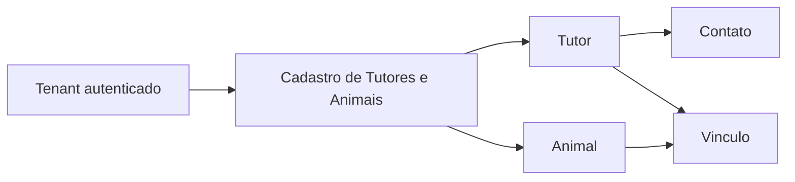

# Tutores e Animais

## Objetivo

Registrar a linguagem ubiqua, as responsabilidades e a fronteira inicial da primeira fatia de negocio da plataforma: cadastro e manutencao de tutores, animais e seus vinculos dentro de uma clinica veterinaria.

Este documento orienta a Entrega 1. Ele nao define entidades, tabelas, endpoints, contratos HTTP ou estrutura fisica de projetos.

## Decisao de fronteira

Tutores e Animais pertencem ao mesmo Bounded Context inicial: **Cadastro de Tutores e Animais**.

Na implementacao inicial, a recomendacao e materializar essa capacidade como um unico modulo de negocio, com linguagem interna em portugues e ownership unico dos dados de tutores, animais, contatos e vinculos. Nao ha evidencia suficiente para criar dois Bounded Contexts, dois DbContexts, dois schemas, dois repositories independentes ou contratos formais entre Tutores e Animais nesta fase.

Entre as alternativas da SDD, a separacao em Bounded Contexts distintos esta rejeitada. A possibilidade de dois modulos internos no mesmo Bounded Context fica tratada como decisao fisica futura, nao como requisito inicial.

A separacao futura em modulos ou Bounded Contexts distintos fica adiada ate existir evidencia de linguagem, regras, ownership, ciclo de vida, caracteristicas de seguranca ou ritmo de mudanca realmente divergentes.

## Glossario

| Termo | Significado inicial |
| --- | --- |
| Tutor | Pessoa responsavel pelo animal no relacionamento operacional com a clinica. |
| Animal | Paciente atendido pela clinica. |
| Vinculo | Relacao entre um tutor e um animal dentro do tenant da clinica. |
| Responsavel principal | Tutor destacado para comunicacoes ou decisoes operacionais quando houver mais de um tutor vinculado ao animal. Deve ser modelado somente se a regra aparecer na Entrega 1. |
| Contato | Canal de comunicacao do tutor, como telefone, e-mail ou outro meio aceito pela clinica. |
| Situacao | Estado operacional de um tutor ou animal, inicialmente ativo ou inativo se houver necessidade do fluxo. |
| Transferencia de responsabilidade | Mudanca confirmada do tutor responsavel por um animal. Nao e uma alteracao implicita nem silenciosa. |

## Termos aceitos e evitados

Termos aceitos na linguagem de dominio:

- `Tutor`;
- `Animal`;
- `Vinculo`;
- `Contato`;
- `Responsavel principal`, quando a regra exigir;
- `Situacao`, quando a regra exigir;
- `CadastrarTutor`;
- `CadastrarAnimal`;
- `VincularAnimalAoTutor`;
- `TransferirResponsabilidadeDoAnimal`.

Termos evitados:

- `Customer`, `Client`, `PetOwner` ou `Owner` para representar tutor;
- `Pet`, quando o conceito do dominio for paciente animal;
- `CreateTutorCommand`, `UpdateAnimalHandler` ou nomes mistos em ingles para casos de uso de dominio;
- `Responsavel financeiro`, sem requisito especifico;
- `Proprietario legal`, como sinonimo automatico de tutor;
- `Shared`, `Common` ou `Core` para compartilhar conceitos de dominio por conveniencia.

Termos tecnicos consolidados podem permanecer em ingles quando representarem infraestrutura ou padroes de codigo, como `Domain`, `Application`, `Infrastructure`, `Controller`, `DbContext`, `Repository`, `Handler`, `Request` e `Response`.

## Responsabilidades

O Bounded Context Cadastro de Tutores e Animais e responsavel por:

- cadastrar, consultar, pesquisar, atualizar e inativar tutores;
- registrar e manter contatos de tutores conforme necessidade do fluxo;
- cadastrar, consultar, pesquisar, atualizar e inativar animais;
- manter o vinculo entre tutor e animal;
- transferir a responsabilidade por um animal somente mediante confirmacao explicita;
- garantir que tutor, animal e vinculo pertencam ao tenant autenticado;
- tratar dados de outro tenant como inexistentes nos fluxos comuns;
- expor contratos publicos futuros orientados a casos de uso, sem expor entidades de dominio ou persistencia.

Nao pertencem a esta fronteira nesta etapa:

- prontuario;
- atendimento;
- vacinacao;
- exames;
- medicamentos;
- agenda;
- faturamento;
- estoque;
- convenio;
- guarda compartilhada;
- pedigree;
- historico clinico.

## Ownership dos dados

O modulo Cadastro de Tutores e Animais sera o owner dos dados funcionais que representem:

- tutores;
- contatos de tutores;
- animais;
- vinculos entre tutores e animais;
- situacao operacional de tutor ou animal, se introduzida.

Quando esses dados forem persistidos, todas as tabelas funcionais devem possuir `tenant_id NOT NULL`, conforme a ADR-0001. Unicidades locais ao tenant devem incluir `tenant_id`, e relacionamentos entre tutor, animal e vinculo devem impedir associacao cruzada entre tenants.

Outros modulos nao devem consultar diretamente tabelas, entidades EF Core, `DbContext` ou repositories desse modulo. Necessidades futuras de agenda, atendimento, faturamento ou notificacao devem usar contratos deliberados, projecoes locais ou workflows definidos quando a funcionalidade existir.

## Fundacao tecnica inicial

O SDD 13 materializa a fronteira como um unico assembly de modulo:

```text
src/Modules/Tutores/PetShop.Tutores/
```

Essa fundacao usa pastas conceituais `Domain`, `Application`, `Infrastructure` e `Api`, mas preserva superficie publica minima. A API carrega o modulo somente pelos pontos de composicao `AddModuloTutores` e `MapModuloTutores`.

Ainda nao existem entidades completas, tabelas funcionais, migrations, repositories, contratos HTTP de caso de uso, endpoints funcionais ou eventos de integracao. Quando houver persistencia, os dados de tutores, contatos, animais e vinculos devem continuar tenant-owned conforme a ADR-0001.

## Invariantes conhecidas

- Tutor, animal e vinculo sempre pertencem a exatamente um tenant autenticado.
- O tenant nao pode ser informado pelo cliente como autoridade em body, rota, query string ou header.
- Dados de outro tenant devem se comportar como inexistentes para operacoes comuns.
- Um animal nao deve ser vinculado a tutor de outro tenant.
- A transferencia de responsabilidade de um animal exige confirmacao explicita.
- Inativar tutor ou animal nao deve apagar historico futuro de atendimento ou faturamento, quando esses contextos existirem.
- O conceito de tutor nao presume propriedade legal do animal.
- Responsavel financeiro nao deve ser separado do tutor sem requisito de negocio.

## Fluxos da Entrega 1

Fluxos minimos de tutor:

- cadastrar tutor;
- consultar tutor;
- atualizar tutor;
- pesquisar tutores;
- inativar tutor.

Fluxos minimos de animal:

- cadastrar animal;
- consultar animal;
- atualizar animal;
- pesquisar animais;
- inativar animal.

Fluxos de vinculo:

- vincular animal a tutor;
- transferir responsabilidade do animal somente apos confirmacao explicita.

Todos os fluxos persistentes da Entrega 1 devem validar isolamento com pelo menos dois tenants.

## Diagrama



## Decisoes adiadas

- Se `Responsavel principal` sera necessario na Entrega 1.
- Se `Situacao` sera modelada como estado explicito ou derivada de regras simples.
- Quais campos de tutor, contato e animal serao obrigatorios nos contratos HTTP.
- Quais regras de unicidade local ao tenant serao exigidas.
- Se a persistencia usara um `DbContext` especifico do modulo ou o `PetShopDbContext` tecnico existente evoluira primeiro.
- Se outros modulos precisarao de contratos de leitura ou projecoes locais sobre tutores e animais.

## Criterios para revisao da fronteira

Revisar a decisao se surgirem evidencias de que tutores e animais:

- usam linguagens conflitantes em fluxos diferentes;
- mudam por motivos frequentes e independentes;
- exigem ownership de dados por times ou capacidades distintas;
- possuem regras transacionais que causam acoplamento excessivo;
- precisam de caracteristicas de seguranca, compliance, disponibilidade ou escala diferentes;
- viram passagem obrigatoria para fluxos de agenda, atendimento ou faturamento sem pertencer a eles.
