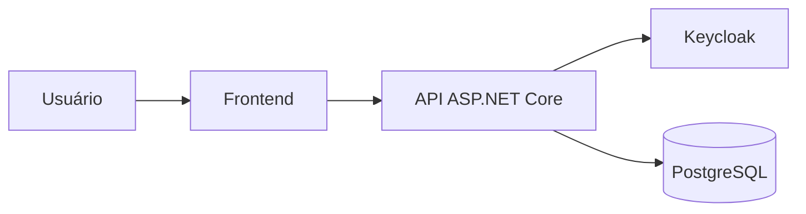

# Modelo de ameaça: [capacidade ou fluxo]

## Metadados

- Owner:
- Revisores:
- Data:
- Última revisão:
- Estado: rascunho | em revisão | aprovado | substituído
- Issues/ADRs relacionadas:

## Escopo

### Objetivo

[Descreva o resultado do fluxo.]

### Incluído

- ...

### Fora de escopo

- ...

## Atores e sistemas externos

| Ator/sistema | Confiança | Responsabilidade |
|---|---|---|
| | | |

## Ativos

| Ativo | Sensibilidade | Owner | Impacto se comprometido |
|---|---|---|---|
| | | | |

## Dados pessoais e regulatórios

- Dados pessoais tratados:
- Finalidades:
- Base/justificativa a validar:
- Documentos ou dados clínicos:
- Retenção e descarte:
- Validação especializada necessária:

## Diagrama de fluxo

Substitua o exemplo pelo fluxo real e identifique as trust boundaries.

## Trust boundaries

1. ...

## Premissas

- ...

## Controles existentes

- ...

## Ameaças

### THR-001 — [título]

- Categoria: STRIDE/LINDDUN
- Cenário:
- Ativo afetado:
- Pré-condições:
- Impacto:
- Probabilidade: baixa | média | alta
- Severidade: baixa | média | alta | crítica
- Controles existentes:
- Mitigação proposta:
- Evidência/teste esperado:
- Owner:
- Estado: aberta | mitigada | aceita | não aplicável

## Checklist multitenant

- [ ] Tenant obtido exclusivamente da claim validada `tenant_id`.
- [ ] Body, rota, query e headers não são autoridade de tenant.
- [ ] Leitura e escrita são filtradas pelo tenant atual.
- [ ] Associações entre tenants são impedidas.
- [ ] Erros não confirmam indevidamente a existência de recurso externo.
- [ ] Exportações, notificações, jobs e cache preservam tenant.
- [ ] Operações cross-tenant possuem autorização e auditoria próprias.
- [ ] Existem testes com tenants A e B.

## Riscos aceitos

| Risco | Justificativa | Owner | Revisar em |
|---|---|---|---|
| | | | |

## Plano de validação

- Testes unitários:
- Testes de integração:
- Testes HTTP:
- Testes de autorização:
- Verificações manuais autorizadas:
- Evidências:

## Questões em aberto

- ...

## Histórico de revisão

| Data | Alteração | Responsável |
|---|---|---|
| | | |
